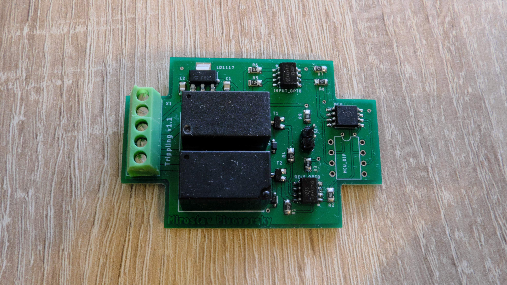

# ComfortTurnSignal

This project is default use for VW Golf MK4 comfort turn signal. 
Schematic and source code it can also be used in another car without comfort turn signal.

Youtube video

# Change log

Version 1.2.1
- HW version 1.2
- SW version 1.4.1

Version 1.2
- HW version 1.2
- SW version 1.4.0

Version 1.1
- HW version 1.1
- SW version 1.3

# Change log SW

Version 1.4.1
- added function, for change blink interval, if is jumper set. Function for this featchure is CheckBlinkIntervalJumper. But if is this function enabled in main.c, then must be definition EEPROM_ENABLE set to 0

Version 1.4.0
- added conf.h file with global MCU configuration
- added debounce time for self calibration SET jumper

Version 1.3.0
- added featchure for disable trippling, when pressing the turn signal control for the opposite direction of flashing

Version 1.2.0
- added fix time for blinking from FLASH memmory

Version 1.1
- Fix bug

Version 1.0
- Init version

# Change log HW

Version 1.2
- update MCU connection
- added SPI programming connector
- added 100nF capacitor for MCU
- added description on the PCB

Version 1.1
- fixed problem with PCB design

Version 1.0
- first version
